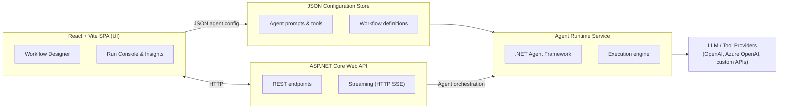

# Magic Agent Workflow Studio

A modular web application for designing, testing, and running AI agent workflows. The stack combines a .NET backend that orchestrates agent executions using the .NET Agent Framework with a modern React + TypeScript SPA powered by Vite, Tailwind CSS, and shadcn/ui components.

## Architecture Overview



### Core Concepts

1. **Frontend SPA** – Presents the workflow editor, run dashboard, and configuration controls.
2. **Backend API** – Exposes endpoints for CRUD on workflows, triggering runs, streaming events, and managing configuration files.
3. **Agent Runtime** – Loads JSON-defined agent profiles, instantiates the .NET Agent Framework runtime, and manages execution lifecycles.
4. **Configuration Store** – Version-controlled JSON files describing agents, workflows, tool chains, environment variables, and runtime policies.
5. **LLM/Tool Providers** – Pluggable connectors to LLMs and external capabilities.

### Architectural patterns & layering

The solution follows a clean, vertical-slice friendly structure:

- **Presentation (MagicAgent.Api/Controllers)** – ASP.NET Core minimal controllers surface CRUD + run endpoints and stay logic-free. They call into the Application layer via injected interfaces, which makes the API host replaceable.
- **Application layer (`Application/*`)** – Coordinates use-cases (agent CRUD, run orchestration, workflow expression evaluation). It depends only on domain abstractions (`IAgentRunner`, `IAgentDefinitionsProvider`, `IWorkflowExpressionEvaluator`) so tests can stub infrastructure easily.
- **Expression subsystem (`Application/Expressions`)** – Tokenizer, Pratt parser, evaluator, and helper registry live behind `IWorkflowExpressionEvaluator`. The resolver keeps both unresolved placeholders and evaluated results for downstream debug tooling.
- **Infrastructure (`Infrastructure/*`)** – File-backed providers, MCP client adapters, diagnostics stores, and streaming progress sinks. These types satisfy application interfaces and can be swapped for cloud versions later.
- **Runtime services (`Application/AgentRunner`, `Infrastructure/AgentRunner`)** – Encapsulate the .NET Agent Framework orchestration, maintain conversation history, and publish progress via `IAgentRunProgressSink` so the UI can display step-by-step telemetry.

Each layer only references the one below it (Presentation → Application → Infrastructure), while cross-cutting services (logging, validation, expression helpers) are registered centrally in `Program.cs`. Dependency injection keeps the seams explicit, making it straightforward to plug in mocks or alternate transports.

## Technology Stack

| Layer            | Technology Choices                                   |
| ---------------- | ---------------------------------------------------- |
| Frontend         | React 18, TypeScript, Vite, Tailwind CSS, shadcn/ui. |
| Backend API      | ASP.NET Core 8 Web API, MediatR\*, FluentValidation. |
| Agent Runtime    | .NET Agent Framework (official), BackgroundService.  |
| Persistence      | Local JSON files (MVP), optional SQL Server          |
| Messaging        | REST + Streaming HTTP SSE                            |
| Tooling / DevOps | pnpm, dotnet CLI, Vitest, xUnit, GitHub Actions      |

## Repository Layout

```
magic-agent/
├── README.md
├── backend/
│   ├── src/
│   │   └── MagicAgent.Api/
│   │       ├── Controllers/
│   │       ├── Application/            # CQRS handlers, validators, mappings
│   │       ├── Infrastructure/         # Agent framework adapters, persistence
│   │       ├── AgentRuntime/           # Background services, runners
│   │       └── MagicAgent.Api.csproj
│   └── tests/
│       └── MagicAgent.Api.Tests/
├── frontend/
│   ├── src/
│   │   ├── app/                        # routing, layout, providers
│   │   ├── features/
│   │   ├── components/
│   │   ├── lib/                        # utilities, API clients
│   │   └── types/
│   ├── public/
│   └── package.json
├── configs/
│   └── agents/                         # JSON agent/workflow definitions
└── docs/
    └── architecture/                   # Extended design notes, diagrams
```

## Workflow Expression Language

The workflow engine now ships with a full expression subsystem that supersedes simple `{{placeholder}}` replacements. Authors can compose math, invoke helpers, traverse JSON, and inspect prior step output without custom code.

### Goals

1. Fully compatible with simple substitutions (`{{placeholder}}` or `${{expression}}`).
2. Provide math/logic so numeric variables can be computed inline.
3. Allow JSON/object graph traversal when variables or parameters contain structured data.
4. Surface reusable helper functions that can be discovered via metadata (`GET /api/workflows/helpers`).

### Expression envelope

- Simple substitutions keep `{{ expr }}` for backwards compatibility.
- Expression-enabled placeholders use `${{ expr }}` to avoid ambiguity with legacy replacements.
- Multiple expressions within one string are allowed; non-expression text is preserved verbatim.
- Expressions evaluate to a string for substitution but operate internally on numbers, booleans, JSON values, or `DateTime` instances.

### Literals & types

| Literal  | Examples                   | Notes                                    |
| -------- | -------------------------- | ---------------------------------------- |
| Numbers  | `42`, `3.14`, `.5`, `1e-3` | Culture invariant (`.` decimal); doubles |
| Strings  | `'hello'`, `"world"`       | Support standard escape sequences        |
| Booleans | `true`, `false`            | Case-insensitive                         |
| Null     | `null`                     | Propagates as empty string when written  |
| JSON     | `{"a":1}`, `[1,2,3]`       | Parsed into `JsonElement`                |

### Identifiers & path access

- Root identifiers: `var.<name>`, `param.<name>` (alias `parameter.`), `input`, `lastOutput`.
- Dot notation accesses object members: `var.order.total`.
- Index notation uses zero-based integers inside brackets: `var.items[0].price`.
- Mixed access (`var.matrix[1][2]`) allowed; invalid paths yield evaluation errors surfaced in debug info.

### Operators

Operator precedence from highest to lowest:

1. Parentheses `( )`
2. Function calls `fn(expr, ...)`
3. Unary `+`, `-`, logical `!`
4. Exponent `^` (right-associative)
5. Multiplicative `*`, `/`, `%`
6. Additive `+`, `-`
7. Comparisons `=`, `!=`, `<`, `<=`, `>`, `>=` (future-proof; may not be in first milestone)
8. Logical `&&`, `||` (future-proof)

Division is floating point; integer division is not special-cased.

### Helper functions

- Helpers live in static classes decorated with `[WorkflowHelper]` + `[WorkflowHelperParameter]` so the registry can publish metadata.
- Names are case-insensitive and inputs are auto-coerced (numbers, booleans, strings, JSON, or `WorkflowExpressionValue`).
- The `/api/workflows/helpers` endpoint returns the catalog consumed by the frontend helper picker.

#### Helper catalog (current)

| Category    | Helper                                                                                                                                                                                                                           | Summary                                |
| ----------- | -------------------------------------------------------------------------------------------------------------------------------------------------------------------------------------------------------------------------------- | -------------------------------------- |
| Math        | `abs`, `sqr`, `sqrt`, `pow(base, exponent)`, `min`, `max`                                                                                                                                                                        | Core numeric ops.                      |
| Strings     | `length`, `toUpper`, `toLower`, `substring(value,start,length?)`, `replace`, `indexOf`, `trim`, `split(separator?)`, `contains`, `startsWith`, `endsWith`, `compare(caseSensitive?, trimWhitespace?)`, `isNullOrEmpty`, `isNull` | Text utilities and comparisons.        |
| Arrays/JSON | `addToArray`, `removeFromArray(removeAll?)`, `indexOnArray(startFromEnd?)`, `replaceElement(replaceAll?)`, `subArray(invert?)`, `concatArrays`, `stringToJson`, `jsonToString`, `arrayLength`                                    | JSON array builders/manipulators.      |
| Dates       | `dateAdd`, `dateDiff`, `dayOfWeek(culture?)`, `toLocalDate`, `toDateUtc(offsetMinutes?)`, `localOffset`, `dateConvert(format?)`, `stringToDate(format?, culture?)`, `datePart(part)`                                             | ISO-friendly date math and formatting. |

### Evaluation semantics

- Tokenizer/parser must be whitespace-tolerant.
- All numeric math uses `double` (`InvariantCulture` for formatting when converted to string).
- When an expression evaluates to JSON and the surrounding context expects a scalar, serialize using compact JSON.
- Errors do not crash the workflow; we fall back to the original `{{expr}}` literal and record the error in `WorkflowParameterDebugInfo`.
- Variable assignments keep both the rendered string and parsed `JsonElement` (when type = JSON) so downstream steps can access structured data.
- Each step surfaces **parameter debug info**: both the unresolved placeholder string and the resolved values/placeholder list travel through the pipeline so the frontend can show what was substituted. This is especially helpful when debugging typed variables.

### Engine architecture

The expression subsystem lives under `MagicAgent.Api/Application/Expressions` and consists of:

1. **Tokenizer & Pratt parser** – Generates an AST for literals, identifiers, helper calls, JSON paths, and unary/binary operators so precedence rules stay centralized.
2. **Evaluator (`WorkflowExpressionEvaluator`)** – Visits the AST against an `ExpressionContext` (variables, parameters, helper registry, input/lastOutput), handling type coercion, JsonElement traversal, and error capture. It also records references for debugging.
3. **Helper registry (`WorkflowHelperRegistry`)** – Discovers `[WorkflowHelper]` methods via reflection, provides metadata, and invokes helpers with runtime type coercion.
4. **Integration seam (`WorkflowPlaceholderResolver`)** – Scans for `{{ }}`/`${{ }}` segments, delegates evaluation, and attaches debug info to `WorkflowParameterDebugInfo` so the frontend can render unresolved/resolved states.

This layering keeps the workflow runner agnostic of expression details and makes it easy to add helpers without touching core execution code.

### Using workflow expressions in practice

1. **Define variables** in upstream steps (agent responses, variable blocks, or tool outputs). Persist both the textual value and the structured `JsonElement`—the evaluator can consume either.
2. **Reference parameters** with either `{{name}}` (legacy) or `${{ expr }}` when you need math, conditional logic, or helper invocations. Mixed literal/expression strings are supported.
3. **Inspect debug info** via the Agent Runner UI: each step lists the original expression, the resolved string, and any helper/placeholder errors that occurred during evaluation. Back-end logs contain the same payload for headless troubleshooting.
4. **Helper discovery** happens automatically: the backend exposes `/api/workflows/helpers`, which the UI renders inside the step configuration drawer so builders can copy helper signatures without leaving the canvas.
5. **Testing expressions** – Unit tests live under `backend/tests/MagicAgent.Api.Tests/Expressions`. Add coverage whenever you introduce operators or helpers to prevent regressions in precedence/typing rules.

## Agent Configuration JSON

Agent behavior is driven by JSON definitions persisted under `configs/agents`. A single file can encapsulate one workflow or a suite of related scenarios.

```jsonc
{
  "agent": {
    "name": "code-reviewer",
    "llm": {
      "provider": "azure-openai",
      "model": "gpt-4o",
      "apiKeySecret": "AZURE_OPENAI_KEY",
      "endpoint": "https://api.openai.azure.com/...",
    },
    "systemPrompt": "You are a helpful code reviewer...",
    "tools": [
      {
        "type": "http",
        "name": "issue-tracker",
        "baseUrl": "https://jira.example.com",
      },
    ],
  },
  "workflow": {
    "steps": [
      {
        "id": "ingest-pr",
        "type": "input",
        "description": "Load pull request diff",
      },
      { "id": "analyze", "type": "agent-step", "agent": "code-reviewer" },
      { "id": "summarize", "type": "agent-step", "agent": "summarizer" },
    ],
    "outputs": [{ "id": "report", "type": "markdown" }],
  },
  "runtime": {
    "maxIterations": 8,
    "timeoutSeconds": 120,
    "retryPolicy": { "maxRetries": 2 },
  },
}
```

### Configuration Conventions

- **Secrets**: Reference environment variables or secure vault keys; never store plain tokens.
- **Validation**: Backend validates JSON against schemas before enabling a workflow.
- **Versioning**: Treat configuration files as code—use PR reviews for changes.

### Configuring MCP Tools

The agent runtime can connect to [Model Context Protocol (MCP)](https://modelcontextprotocol.io/) servers declared in each agent definition. Tools are resolved at run time and surfaced to the AI agent so it can call remote capabilities.

```jsonc
{
  "agents": [
    {
      "id": "docs-assistant",
      "name": "Docs Assistant",
      "description": "Answers questions using internal documentation.",
      "defaultParameters": {
        "endpoint": "https://my-azure-openai-host.openai.azure.com/",
        "deployment": "gpt-4o",
      },
      "steps": [
        {
          "name": "chat",
          "type": "chat",
          "parameters": {
            "systemPrompt": "You are a helpful support assistant. Use tools when needed.",
          },
          "conversation": { "enabled": true },
        },
      ],
      "tools": [
        {
          "id": "knowledge-base",
          "type": "mcp",
          "name": "KnowledgeBase",
          "description": "Searches the internal documentation site.",
          "serverUrl": "https://mcp.example.com/api",
          "protocol": "sse",
          "headers": {
            "Authorization": "Bearer ${INTERNAL_DOCS_TOKEN}",
          },
          "allowedTools": ["search", "get_article"],
          "actions": [
            {
              "name": "doc-search",
              "description": "Search the documentation for a topic",
              "parameters": {
                "tool": "search",
              },
            },
          ],
        },
      ],
    },
  ],
}
```

Key properties:

| Field          | Required | Notes                                                                                                                                                                         |
| -------------- | -------- | ----------------------------------------------------------------------------------------------------------------------------------------------------------------------------- |
| `id`           | ✅       | Unique tool identifier used in logs.                                                                                                                                          |
| `type`         | ✅       | Use `mcp` (or `mcp-http`) for HTTP/SSE hosted MCP servers.                                                                                                                    |
| `serverUrl`    | ✅       | Base URL for the MCP server endpoint. Must be HTTP/HTTPS.                                                                                                                     |
| `protocol`     | ➖       | `auto` (default), `http`/`streamable-http`, or `sse`.                                                                                                                         |
| `headers`      | ➖       | Key/value pairs forwarded on every MCP request (authenticate with bearer/API keys here).                                                                                      |
| `allowedTools` | ➖       | Whitelist of remote tool names returned by the MCP server. Filters out any other tools.                                                                                       |
| `actions`      | ➖       | Optional local aliases that customize tool `name`/`description` or map to different MCP tool IDs via the `parameters.tool` property. Useful for renaming tools for the model. |

At runtime, the backend instantiates an MCP `HttpClientTransport`, completes the server handshake, and loads available MCP tools. The selected or aliased tools are then passed to the .NET Agent Framework as `AITool` instances. The frontend Agent Runner lists the configured MCP tools so you can verify connectivity options before running a conversation.

#### Security Recommendations

- Store tokens referenced by `headers` in environment variables (e.g., `${INTERNAL_DOCS_TOKEN}`) and resolve them via your secrets provider.
- Favor HTTPS endpoints; avoid exposing internal MCP servers publicly.
- Use `allowedTools` to prevent agents from calling experimental or destructive remote tools.
- Monitor MCP server logs for troubleshooting and auditing tool usage.

## Development Environment Setup

### Prerequisites

- Node.js ≥ 20.x and pnpm 9.x (`corepack enable` recommended)
- .NET SDK 8.0
- Optional: Docker Desktop (for future containerized services)
- Recommended IDEs: VS Code with C# Dev Kit and Tailwind IntelliSense

### Clone & Bootstrap

```bash
pnpm install --dir frontend
pnpm dlx shadcn-ui@latest init --dir frontend  # one-time component registry setup

dotnet restore backend/src/MagicAgent.Api/MagicAgent.Api.csproj
```

### Environment Variables

Create `backend/src/MagicAgent.Api/appsettings.Development.json` (or use Secret Manager):

```jsonc
{
  "Logging": {
    "LogLevel": {
      "Default": "Information",
      "Microsoft": "Warning",
    },
  },
  "AgentRuntime": {
    "ConfigsPath": "../../../../configs/agents",
  },
  "LLM": {
    "Providers": {
      "AzureOpenAi": {
        "Endpoint": "https://api.openai.azure.com/...",
        "ApiKey": "${AZURE_OPENAI_KEY}",
        "Deployment": "gpt-4o",
      },
    },
  },
}
```

For the frontend, add `.env.local` under `frontend/`:

```
VITE_API_BASE_URL=https://localhost:5001
```

## Running the Stack (Development)

1. **Backend**
   ```bash
   dotnet watch run --project backend/src/MagicAgent.Api/MagicAgent.Api.csproj
   ```
2. **Frontend**
   ```bash
   pnpm --dir frontend dev
   ```

The SPA will proxy API calls to `VITE_API_BASE_URL`. Configure CORS in the backend for the dev origin (`http://localhost:5173`).

## API Authentication Modes

The frontend talks to two classes of endpoints:

| Endpoint                  | Example                                                                    | Auth strategy                                                       |
| ------------------------- | -------------------------------------------------------------------------- | ------------------------------------------------------------------- |
| Protected management APIs | `/api/agents/definitions`, `/api/workflows/helpers`, diagnostics endpoints | MSAL-issued ID token automatically attached by `useAuthorizedFetch` |
| Anonymous run endpoint    | `/api/agents/{id}/runs` (including SSE streaming variant)                  | **No MSAL token** – user-supplied tool token is forwarded unchanged |

`useAuthorizedFetch` now accepts `includeAuth` (default `true`). All protected calls continue to do:

```ts
await authorizedFetch(`${API}/api/agents/definitions`);
```

To invoke the run endpoint, disable MSAL auth and provide the tool header that should flow to MCP tools:

```ts
await authorizedFetch(`${API}/api/agents/${agentId}/runs`, {
  method: "POST",
  includeAuth: false,
  headers: {
    "Content-Type": "application/json",
    Authorization: userProvidedToken,
  },
  body: JSON.stringify({ input, conversationId }),
});
```

This keeps the RUN endpoint aligned with backend expectations (unauthenticated but requiring a manually entered token) while preserving the stricter policy everywhere else.

## Testing & Quality Gates

- **Backend**: xUnit + FluentAssertions + WebApplicationFactory for integration tests. `dotnet test backend/tests/MagicAgent.Api.Tests`.
- **Frontend**: Vitest + Testing Library + MSW for API mocking. `pnpm --dir frontend test`.
- **E2E**: Playwright (planned) to validate workflow execution end-to-end.
- **Static Analysis**: ESLint, Stylelint, TypeScript strict mode, and `dotnet format`/Roslyn analyzers.

## Deployment Strategy (Roadmap)

| Environment | Deployment Target                    | Notes                                  |
| ----------- | ------------------------------------ | -------------------------------------- |
| Dev         | Local containers / GitHub Codespaces | Rapid iteration, hot reload            |
| Staging     | Azure App Service + Static Web Apps  | Automated CI/CD with integration tests |
| Production  | Azure App Service / Kubernetes       | Observability via Application Insights |

Artifacts: docker images for backend, static build for frontend (`pnpm build`).

---

This README captures the target architecture and conventions guiding future code generation and implementation tasks.
