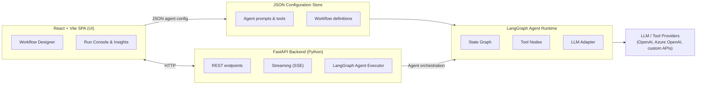

# Magic Agent Workflow Studio - Python Backend Architecture

## 1. Architecture Overview

### Objective

**Magic Agent Workflow Studio** is a modular web application for designing, testing, and running AI agent workflows. Users compose workflows visually in the frontend, reference JSON-defined agent configurations, and execute agents that orchestrate LLM calls, tool invocations, and multi-step reasoning pipelines.

The **Python Backend** is a FastAPI-based REST API service that replaces the existing .NET backend. It provides:
- CRUD operations for agent and workflow definitions
- Synchronous and streaming (SSE) agent execution endpoints
- A workflow expression engine for placeholder substitution and inline computation
- Integration with LLM providers (Azure OpenAI, OpenAI) and MCP tool servers
- LangGraph-based agent runtime for complex, multi-step AI workflows with state management, tool calling, and iteration control

### Design Principles

1. **Feature Parity** – All .NET endpoints are replicated with equivalent Python functionality
2. **Clean Layering** – API → Application → Infrastructure → Agent Runtime; no cross-layer dependencies
3. **Expression Compatibility** – `{{variable}}` and `${{expression}}` syntax preserved end-to-end
4. **Async-First** – Full async/await throughout for FastAPI compatibility and SSE streaming
5. **Config as Code** – Agent definitions live in version-controlled JSON files; no secret embedding

## 2. Technology Stack

| Layer              | .NET Backend (Current)               | Python Backend (Target)                          |
| ------------------ | ------------------------------------ | ------------------------------------------------ |
| **Web Framework**  | ASP.NET Core 8 Web API               | FastAPI 0.110+ (async-first)                     |
| **Agent Runtime**  | .NET Agent Framework                 | LangGraph (latest) / LangChain (latest)          |
| **Validation**     | FluentValidation                     | Pydantic v2                                      |
| **Async Messaging**| MediatR (CQRS pattern)              | FastAPI Depends + custom async handlers          |
| **SSE Streaming**  | `System.Threading.Channels`          | `fastapi.responses.StreamingResponse` + async    |
| **MCP Client**      | Microsoft.Agents.Mcp                | `mcp` Python SDK (latest)                        |
| **State Persistence** | In-memory / file                 | LangGraph built-in checkpointing                 |
| **Persistence**     | Local JSON files                     | Local JSON files (no database)                   |
| **Testing**         | xUnit + FluentAssertions             | pytest + pytest-asyncio + pytest-cov             |
| **Auth**            | MSAL (optional)                      | None (anonymous access)                           |
| **Linting**         | Roslyn analyzers, dotnet format      | ruff, mypy, black                                |

## 3. Project Structure

```
magic-agent/
├── backend-py/                         # Python backend root
│   ├── src/                            # All Python source code
│   │   ├── __init__.py
│   │   ├── main.py                     # FastAPI app entry point
│   │   ├── config.py                   # Settings using Pydantic
│   │   ├── api/                        # REST API layer
│   │   │   ├── __init__.py
│   │   │   ├── routes/
│   │   │   │   ├── __init__.py
│   │   │   │   ├── agents.py           # Agent CRUD endpoints
│   │   │   │   ├── runs.py             # Run execution + SSE
│   │   │   │   ├── workflows.py        # Workflow helpers & expressions
│   │   │   │   └── health.py
│   │   │   ├── dependencies.py          # FastAPI Depends
│   │   │   └── middleware.py            # CORS, logging, etc.
│   │   ├── application/                # Use case orchestration
│   │   │   ├── __init__.py
│   │   │   ├── agents/
│   │   │   │   ├── __init__.py
│   │   │   │   ├── schemas.py           # Pydantic DTOs
│   │   │   │   ├── service.py          # Agent business logic
│   │   │   │   └── exceptions.py
│   │   │   ├── workflows/
│   │   │   │   ├── __init__.py
│   │   │   │   ├── schemas.py
│   │   │   │   ├── service.py
│   │   │   │   └── expressions/        # Expression engine
│   │   │   │       ├── __init__.py
│   │   │   │       ├── evaluator.py
│   │   │   │       ├── tokenizer.py
│   │   │   │       ├── parser.py
│   │   │   │       ├── helpers.py       # Math, String, Date, Array helpers
│   │   │   │       └── context.py
│   │   │   └── runs/
│   │   │       ├── __init__.py
│   │   │       ├── schemas.py
│   │   │       ├── service.py
│   │   │       └── progress.py          # SSE progress events
│   │   ├── infrastructure/             # External concerns
│   │   │   ├── __init__.py
│   │   │   ├── persistence/
│   │   │   │   ├── __init__.py
│   │   │   │   ├── file_provider.py
│   │   │   │   └── json_store.py
│   │   │   ├── mcp/
│   │   │   │   ├── __init__.py
│   │   │   │   ├── client.py
│   │   │   │   ├── transport.py
│   │   │   │   └── tool_builder.py
│   │   │   ├── llm/
│   │   │   │   ├── __init__.py
│   │   │   │   ├── factory.py           # LLM client factory
│   │   │   │   ├── azure_openai.py
│   │   │   │   └── openai.py
│   │   │   └── diagnostics/
│   │   │       ├── __init__.py
│   │   │       └── store.py
│   │   ├── agent_runtime/              # LangGraph integration
│   │   │   ├── __init__.py
│   │   │   ├── graph.py                # LangGraph StateGraph definition
│   │   │   ├── nodes/
│   │   │   │   ├── __init__.py
│   │   │   │   ├── chat_node.py         # LLM chat node
│   │   │   │   ├── tool_node.py         # Tool execution node
│   │   │   │   ├── input_node.py        # Input processing
│   │   │   │   └── output_node.py       # Output formatting
│   │   │   ├── state.py                # Agent state definition
│   │   │   ├── executor.py             # Graph execution runner
│   │   │   └── checkpoint.py           # State persistence
│   │   └── lib/                        # Shared utilities
│   │       ├── __init__.py
│   │       ├── logging.py
│   │       └── security.py
│   ├── tests/                          # Test suite (sibling to src/)
│   │   ├── __init__.py
│   │   ├── conftest.py                 # pytest fixtures
│   │   ├── api/
│   │   ├── application/
│   │   └── agent_runtime/
│   ├── pyproject.toml                  # Project metadata & dependencies
│   ├── Dockerfile                     # Container image definition
│   └── .env.example                   # Environment variable template
├── backend/                           # .NET backend (unchanged, side-by-side)
├── frontend/                          # React SPA (unchanged)
├── configs/
│   └── agents/                        # JSON agent/workflow definitions (shared)
└── docs/
    └── architecture/
        └── PYTHON_BACKEND_ARCHITECTURE.md
```

## 4. Architecture Diagram



## 5. Component Design

### 5.1 API Layer (`api/routes/`)

**Pattern**: FastAPI Router with dependency injection

| Endpoint | Method | Description | Auth |
|----------|--------|-------------|------|
| `/api/agents/definitions` | GET, PUT | List/update agent definitions | MSAL (future) |
| `/api/agents/{agent_id}` | GET, DELETE | Get/delete single agent | MSAL (future) |
| `/api/agents/{agent_id}/runs` | POST | Trigger agent run (sync) | Token passthrough |
| `/api/agents/{agent_id}/runs/stream` | POST | SSE streaming run | Token passthrough |
| `/api/workflows/helpers` | GET | List expression helpers | MSAL (future) |
| `/api/workflows/evaluate` | POST | Evaluate expression | MSAL (future) |
| `/health` | GET | Health check | None |

**Key differences from .NET**:
- Use `fastapi.responses.StreamingResponse` with async generators for SSE
- Use `from __future__ import annotations` for forward references
- Pydantic models replace C# record DTOs

### 5.2 Application Layer (`application/`)

**Pattern**: Service classes with clear interfaces (no MediatR - direct DI)

#### Agent Service
- `get_agent(agent_id: str) -> AgentDefinition`
- `list_agents() -> list[AgentDefinition]`
- `upsert_agent(agent_id: str, definition: AgentDefinition) -> AgentDefinition`
- `delete_agent(agent_id: str) -> None`

#### Workflow Expression Service
- `evaluate_expression(expr: str, context: ExpressionContext) -> ExpressionResult`
- `get_helpers() -> list[HelperDescriptor]`
- `resolve_placeholders(template: str, context: ExpressionContext) -> ResolvedTemplate`

### 5.3 Agent Runtime (`agent_runtime/`)

**LangGraph Integration**:

```python
# State definition
class AgentState(TypedDict):
    messages: Annotated[list[BaseMessage], operator.add]
    context: dict[str, Any]  # Variables, parameters
    step_outputs: dict[str, Any]
    current_step: str
    iteration: int

# Graph structure
graph = StateGraph(AgentState)
graph.add_node("chat", chat_node)
graph.add_node("tools", tool_node)
graph.add_node("input", input_node)
graph.add_edge("__start__", "input")
graph.add_conditional_edges("input", should_continue, {
    "agent": "chat",
    "end": "__end__"
})
graph.add_edge("chat", "tools")
graph.add_conditional_edges("tools", should_continue, {
    "agent": "chat",
    "end": "__end__"
})
```

**Key LangChain components**:
- `ChatOpenAI` / `AzureChatOpenAI` for LLM
- `StructuredChatAgent` for tool-calling agents
- `ToolExecutor` from LangChain core
- `AsyncCallbackHandler` for SSE progress streaming

### 5.4 Infrastructure Layer (`infrastructure/`)

#### LLM Factory
```python
class LLMFactory:
    def create_chat_model(
        provider: Literal["openai", "azure-openai"],
        config: LLMConfig
    ) -> BaseChatModel:
        match provider:
            case "azure-openai":
                return AzureChatOpenAI(
                    azure_endpoint=config.endpoint,
                    api_key=config.api_key,
                    deployment_name=config.deployment,
                    ...
                )
            case "openai":
                return ChatOpenAI(model=config.model, api_key=config.api_key)
```

#### MCP Client
- Use official `mcp` Python SDK
- `McpClient` wraps `HttpClientTransport` for HTTP/SSE protocols
- Convert MCP tools to LangChain `Tool` format

### 5.5 Expression Engine (`application/workflows/expressions/`)

Re-implement the .NET expression subsystem:

| .NET Component | Python Equivalent |
|----------------|-------------------|
| `WorkflowExpressionTokenizer` | `tokenizer.py` - regex-based tokenizer |
| `WorkflowExpressionParser` (Pratt) | `parser.py` - recursive descent or Pratt parser |
| `WorkflowExpressionEvaluator` | `evaluator.py` - visitor pattern |
| `WorkflowHelperRegistry` | `helpers.py` - decorated functions with `WorkflowHelper` |
| `WorkflowPlaceholderResolver` | `evaluator.py` - regex scan for `{{ }}` / `${{ }}` |

**Expression format preserved**:
- `{{variable}}` - simple substitution
- `${{expression}}` - full expression with operators, helpers

**Helper catalog** (same as .NET):

| Category | Helpers |
|----------|---------|
| Math | `abs`, `sqr`, `sqrt`, `pow`, `min`, `max` |
| Strings | `length`, `toUpper`, `toLower`, `substring`, `replace`, `indexOf`, `trim`, `split`, `contains`, `startsWith`, `endsWith`, `compare`, `isNullOrEmpty`, `isNull` |
| Arrays/JSON | `addToArray`, `removeFromArray`, `indexOnArray`, `replaceElement`, `subArray`, `concatArrays`, `stringToJson`, `jsonToString`, `arrayLength` |
| Dates | `dateAdd`, `dateDiff`, `dayOfWeek`, `toLocalDate`, `toDateUtc`, `localOffset`, `dateConvert`, `stringToDate`, `datePart` |

## 6. Data Flow

### 6.1 Agent Run Execution

```
1. POST /api/agents/{id}/runs
   └─> RunRequest(input, conversation_id, parameters)

2. AgentRunsService.trigger_run()
   ├─> Load agent definition from FileProvider
   ├─> Create ExpressionContext (variables, parameters)
   ├─> Create LangGraph executor with progress callback
   └─> Return run_id immediately (or stream)

3. LangGraphExecutor.run()
   ├─> Initialize AgentState
   ├─> Execute graph until terminal state or max_iterations
   ├─> For each step:
   │   ├─> Evaluate placeholders in step config
   │   ├─> Execute node (chat/tools/input/output)
   │   └─> Emit progress event via SSE
   └─> Return final state

4. SSE Progress Events
   - step_start: { step_id, step_type }
   - step_complete: { step_id, output, duration_ms }
   - iteration: { iteration, max_iterations }
   - error: { message, recoverable }
   - complete: { final_output, total_duration_ms }
```

### 6.2 Expression Evaluation Flow

```
1. PlaceholderResolver.resolve("Hello ${{toUpper(param.name)}}!")
   ├─> Regex scan finds ${{ ... }} segments
   ├─> For each expression:
   │   ├─> Tokenizer.tokenize("toUpper(param.name)")
   │   ├─> Parser.parse(tokens) -> AST
   │   └─> Evaluator.evaluate(ast, context)
   │       ├─> Resolve param.name from context
   │       ├─> Call helper(toUpper, ["John"])
   │       └─> Return "JOHN"
   └─> Interpolate results: "Hello JOHN!"
```

## 7. Configuration

### 7.1 Settings (`config.py`)

```python
from pydantic_settings import BaseSettings, SettingsConfigDict

class Settings(BaseSettings):
    model_config = SettingsConfigDict(
        env_file=".env",
        env_file_encoding="utf-8",
        case_sensitive=False
    )

    # Runtime
    configs_path: Path = Path("../../configs/agents")

    # LLM Defaults
    llm_provider: str = "azure-openai"
    llm_endpoint: str | None = None
    llm_api_key: str | None = None
    llm_deployment: str = "gpt-4o"
    llm_model: str = "gpt-4o"

    # API
    cors_origins: list[str] = ["http://localhost:5173"]
    log_level: str = "INFO"

    # Runtime Limits
    max_iterations: int = 50
    default_timeout_seconds: int = 120
```

### 7.2 Environment Variables

```bash
# .env for Python backend
AGENT_RUNTIME_CONFIGS_PATH=../../configs/agents
LLM_PROVIDER=azure-openai
LLM_ENDPOINT=https://xxx.openai.azure.com
LLM_API_KEY=${AZURE_OPENAI_KEY}
LLM_DEPLOYMENT=gpt-4o
MAX_ITERATIONS=50
DEFAULT_TIMEOUT_SECONDS=120
```

## 8. Key Implementation Notes

### 8.1 SSE Progress Streaming

```python
async def stream_run(agent_id: str, request: RunRequest):
    async def event_generator():
        async for event in executor.run_with_callbacks(request.input):
            match event:
                case StepStartEvent() as e:
                    yield f"data: {e.model_dump_json()}\n\n"
                case StepCompleteEvent() as e:
                    yield f"data: {e.model_dump_json()}\n\n"
                case CompleteEvent() as e:
                    yield f"data: {e.model_dump_json()}\n\n"
                case ErrorEvent() as e:
                    yield f"data: {e.model_dump_json()}\n\n"

    return StreamingResponse(
        event_generator(),
        media_type="text/event-stream",
        headers={"Cache-Control": "no-cache"}
    )
```

### 8.2 Tool Definition Conversion (MCP → LangChain)

```python
def mcp_tool_to_langchain(mcp_tool: McpTool) -> Tool:
    def _run(tool_input: str) -> str:
        # Execute MCP tool call
        ...

    return Tool(
        name=mcp_tool.name,
        description=mcp_tool.description,
        func=_run,
        args_schema=create_model(f"{mcp_tool.name}Input", **mcp_tool.parameters)
    )
```

### 8.3 State Management Between Steps

```python
class WorkflowContext:
    """Maintains state across agent steps - replaces ConversationContext"""

    def __init__(self):
        self.variables: dict[str, Any] = {}
        self.parameters: dict[str, Any] = {}
        self.step_outputs: dict[str, StepOutput] = {}
        self.conversation_history: list[BaseMessage] = []

    def get_last_output(self) -> Any:
        return self.step_outputs.get("__last__", NullStepOutput()).value
```

## 9. Testing Strategy

| Test Type | Framework | Location |
|-----------|-----------|----------|
| Unit | pytest | `tests/application/`, `tests/agent_runtime/` |
| Integration | pytest + TestClient | `tests/api/` |
| Expression Parser | pytest | `tests/application/workflows/expressions/` |
| E2E (future) | Playwright | `tests/e2e/` |

**Key test fixtures** (`conftest.py`):
```python
@pytest.fixture
def sample_agent_definition():
    return load_json("configs/agents/sample-agent.json")

@pytest.fixture
async def async_client():
    async with AsyncClient(app=app, base_url="http://test") as client:
        yield client

@pytest.fixture
def expression_context():
    return ExpressionContext(
        variables={"name": "test"},
        parameters={"input": "hello"}
    )
```

## 10. Migration Checklist

- [x] Create `backend-py/` package structure with `src/` and `tests/` siblings
- [x] Implement Pydantic settings and config loading
- [x] Port expression engine (tokenizer, parser, evaluator, helpers)
- [x] Implement `FileAgentDefinitionsProvider` (JSON file-based)
- [x] Implement `LLMFactory` with Azure OpenAI support
- [x] Implement LangGraph `AgentState` and nodes (async-first)
- [x] Implement agent run executor with `AsyncCallbackHandler` progress callbacks
- [x] Implement SSE streaming endpoint
- [x] Implement REST API routes (async throughout)
- [x] Add MCP client integration using latest `mcp` Python SDK
- [x] Write unit and integration tests
- [x] Configure CORS and security middleware
- [x] Create `pyproject.toml` with all dependencies
- [x] Create `Dockerfile` for containerized deployment
- [ ] Update frontend API client if needed

## 11. Decisions

The following decisions have been made:

| # | Decision | Rationale |
|---|----------|-----------|
| **MCP SDK** | Use latest version of official `mcp` Python SDK | Official SDK provides the most maintainable integration path; aligns with upstream MCP protocol evolution |
| **State Persistence** | Use LangGraph's built-in checkpointing | Enables conversation history persistence and multi-step workflow recovery without additional infrastructure |
| **LangChain Version** | Use latest available version | Ensures access to newest features and fixes; pin to specific minor version in production |
| **Auth Strategy** | No authentication for now | Anonymous access; token passthrough for LLM/tool providers preserved as-is |

### Remaining Decisions

All decisions have been made:

| # | Decision | Rationale |
|---|----------|-----------|
| **MCP SDK** | Use latest version of official `mcp` Python SDK | Official SDK provides the most maintainable integration path; aligns with upstream MCP protocol evolution |
| **State Persistence** | Use LangGraph's built-in checkpointing | Enables conversation history persistence and multi-step workflow recovery without additional infrastructure |
| **LangChain Version** | Use latest available version | Ensures access to newest features and fixes; pin to specific minor version in production |
| **Auth Strategy** | No authentication for now | Anonymous access; token passthrough for LLM/tool providers preserved as-is |
| **Async Granularity** | Full async-first with `AsyncCallbackHandler` | Non-blocking SSE streaming, better concurrency, aligns with FastAPI async nature |
| **Database** | No database for now | JSON file persistence for workflow definitions; LangGraph checkpointing for state; no SQL/SQLAlchemy in MVP |

## 12. References

- [FastAPI Documentation](https://fastapi.tiangolo.com/)
- [LangGraph Documentation](https://langchain-langgraph.readthedocs.io/)
- [LangChain Expression Language](https://python.langchain.com/docs/how_to/expression_language/)
- [MCP Python SDK](https://github.com/modelcontextprotocol/python-sdk)
- [Pydantic v2](https://docs.pydantic.dev/)