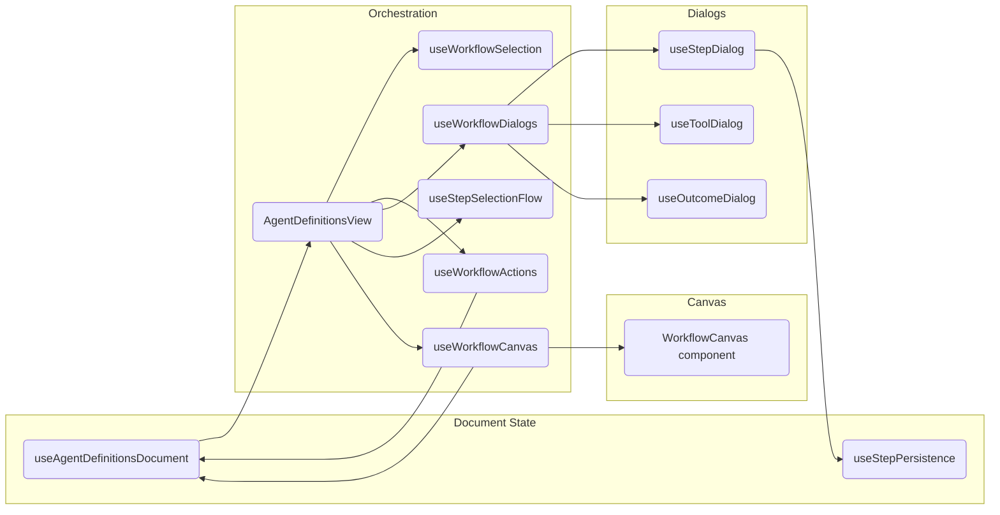

# Magic Agent Frontend

## Architecture overview

The workflow builder stacks deterministic document state on top of ReactFlow. Hooks/components stay small, focused, and testable:

- **AgentDefinitionsView** orchestrates everything: it subscribes to document state, wires dialogs/toolbox actions, and renders the canvas under a `ReactFlowProvider`.
- **useAgentDefinitionsDocument** owns the authoritative draft JSON plus persistence helpers (`applyDocumentUpdate`, `documentRevision`, save/reload handlers).
- **useWorkflowCanvas** adapts a computed `WorkflowGraph` into ReactFlow `nodes`/`edges`, updating layout + viewport back through `applyDocumentUpdate`.
- **WorkflowCanvas** is a presentation wrapper over `<ReactFlow>` that honors the graph signature and exposes drag/edge handlers coming from `useWorkflowCanvas`.
- **Dialog/action hooks** (`useWorkflowDialogs`, `useWorkflowSelection`, `useWorkflowActions`, `useStepSelectionFlow`, `useStepPersistence`) compartmentalize UX flows so AgentDefinitionsView remains declarative.

### Dependency graph



State changes still flow in one direction: hooks mutate through `applyDocumentUpdate` → `documentRevision` ticks → AgentDefinitionsView rebuilds the graph → `useWorkflowCanvas` emits a new `graphSignature` → `WorkflowCanvas` re-syncs ReactFlow’s internal state.

## Key libraries & patterns

- **React + Vite**: modern dev/build pipeline with fast HMR.
- **ReactFlow**: canvas rendering + interactions for graph editing.
- **Tailwind CSS + CVA/tailwind-merge**: utility-first styling with composition helpers for shared components.
- **Radix UI slots + lucide-react**: accessible primitives and icons.
- **Monaco editor**: JSON editor surface within the advanced tab.
- **Custom hooks + refs**: prefer `useRef` for mutable workflow state (document/layout) combined with revision counters to stay React-StrictMode safe.
- **Step persistence hooks**: `useStepPersistence` centralizes draft mutations (create/update/delete) so dialogs and the toolbox share undo-safe helpers.
- **Dialog orchestration**: `useWorkflowDialogs`, `useStepDialog`, and `useWorkflowDialogs` coordinate modal state, validation, and payload assembly. They emit typed events consumed by `AgentDefinitionsView` and tests.
- **Testing library + MSW**: Vitest suites under `src/components/agent-definitions/hooks/__tests__` exercise workflow hooks with mocked documents and verify layout persistence, dialog flows, and regression fixes.

## Debug logging

Runtime workflow diagnostics are fully gated behind the `VITE_WORKFLOW_DEBUG_LOGGING` flag. Add the following to `.env.local` (or export it in your shell) when you need to troubleshoot layout persistence, ReactFlow graph builds, or document mutations:

```bash
VITE_WORKFLOW_DEBUG_LOGGING=true
```

When the flag is `false` (the default), **no workflow-related `console.*` logging will appear**. Setting the flag to `true` enables verbose tracing for:

- `useAgentDefinitionsDocument` (document revisions, serialization snapshots)
- `useWorkflowCanvas` (node/edge persistence, layout cleanup, viewport updates)
- `buildWorkflowGraph` (desired start-edge target)
- `AgentDefinitionsView` (active agent + graph signature snapshots)
- `useWorkflowActions` (start-step mutations)

You can also temporarily override logging in the browser console without restarting the dev server:

```js
window.__MAGIC_AGENT_DEBUG_WORKFLOW = true;
```

## Start step + ReactFlow refresh notes

Keeping the “start edge” in sync required a combination of fixes:

1. **Document ref & revision counter** – `useAgentDefinitionsDocument` stores the latest draft in a ref (`documentRef`) and bumps `documentRevision` after each mutation so memoized consumers always see the newest data (even under React StrictMode’s double renders).
2. **Graph + canvas signatures** – `useWorkflowCanvas` derives a `graphSignature` (hash of nodes + edges). `AgentDefinitionsView` passes that signature as a `key` to `WorkflowCanvas`, forcing ReactFlow to refresh whenever the graph changes.
3. **Edge syncing with guards** – `WorkflowCanvas` updates ReactFlow’s internal edge state only when the signature changes, avoiding infinite update loops but guaranteeing the start edge redraws immediately.

If you modify any of these areas (document state management, graph builder, or ReactFlow bindings), double-check that:

- `documentRevision` increments whenever the draft changes.
- `graphSignature` changes when start-step assignments change.
- Debug logging remains optional and controlled exclusively by `VITE_WORKFLOW_DEBUG_LOGGING`.

## Future enhancement ideas

1. **State persistence service** – extract `applyDocumentUpdate` mutations for layout/viewport into a dedicated module to simplify hook dependencies.
2. **Graph diffing tests** – add unit tests around `buildWorkflowGraph` to prevent regressions when changing start-step logic or layout heuristics.
3. **Undo/redo stack** – leverage the serialized document snapshots to allow reverting accidental edits.
4. **Plugin-style node renderers** – expose a registry for new node types beyond steps/tools (e.g., integrations), keeping ReactFlow configuration centralized.
5. **Viewport bookmarks** – store multiple named viewports per workflow for faster navigation of large graphs.

## Development scripts

This project uses Vite + React + TypeScript. Common commands:

```bash
npm install      # install dependencies
npm run dev      # start Vite dev server
npm run build    # production build
npm run preview  # preview build output
```

### Testing & quality gates

- `pnpm test` – Vitest unit suites (hooks, utilities, graph builders).
- `pnpm lint` – ESLint + TypeScript project references.
- `pnpm format` – Biome/Prettier (depending on workspace settings) to keep code style aligned.
- `pnpm coverage` (optional) – Generates coverage reports for critical hooks (step persistence, dialogs, workflow graph builder) so we can track regressions after component reorganizations.

### Frontend re-organization highlights

1. **Hooks folder structure** – `components/agent-definitions/hooks` groups related concerns (`useStepPersistence`, dialog hooks, workflow actions) with colocated tests to keep refactors safe.
2. **Component split** – Toolbox, builder panel, and canvas live in dedicated files to avoid monolithic views. Each component receives plain callbacks, making them trivial to storybook/test later.
3. **Iconography refresh** – Shared visuals (e.g., agent step icon) are defined inside `stepTypeVisuals.ts` so toolbar buttons and graph nodes stay in sync.
4. **State lifting** – `AgentDefinitionsView` owns just the orchestration glue; business logic sits inside hooks with explicit inputs/outputs, simplifying future migration to server-driven runs.
