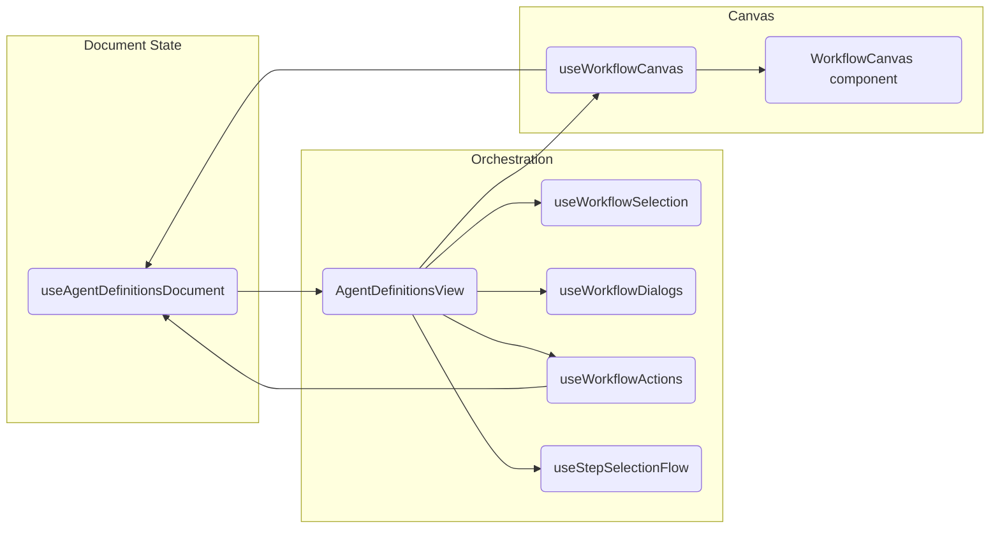

# Magic Agent Frontend

## Architecture overview

The workflow builder experience is composed of a small set of focused hooks and components layered on top of ReactFlow:

- **AgentDefinitionsView**: orchestration shell that wires document state, dialogs, and the canvas. It memoizes the active agent/graph and owns the ReactFlow Provider.
- **useAgentDefinitionsDocument**: source of truth for the draft JSON document, with `documentRevision` forcing downstream re-computations.
- **useWorkflowCanvas**: adapts a `WorkflowGraph` into ReactFlow-friendly `nodes`/`edges`, preserving layout + viewport back into the document via `applyDocumentUpdate`.
- **WorkflowCanvas (component)**: thin view wrapper around `<ReactFlow>` that syncs edges/nodes based on signatures and exposes user interactions (drag, click, viewport changes).
- **Workflow dialogs & actions hooks** (`useWorkflowDialogs`, `useWorkflowSelection`, `useWorkflowActions`, `useStepSelectionFlow`): each hook isolates dialog state, command handlers, and mutations, keeping AgentDefinitionsView lean.

### Dependency graph



The flow to update the start edge is thus: dialogs/actions mutate the document → `documentRevision` increments → `AgentDefinitionsView` rebuilds the `WorkflowGraph` → `useWorkflowCanvas` computes a new `graphSignature` → `WorkflowCanvas` re-syncs ReactFlow’s internal state.

## Key libraries & patterns

- **React + Vite**: modern dev/build pipeline with fast HMR.
- **ReactFlow**: canvas rendering + interactions for graph editing.
- **Tailwind CSS + CVA/tailwind-merge**: utility-first styling with composition helpers for shared components.
- **Radix UI slots + lucide-react**: accessible primitives and icons.
- **Monaco editor**: JSON editor surface within the advanced tab.
- **Custom hooks + refs**: prefer `useRef` for mutable workflow state (document/layout) combined with revision counters to stay React-StrictMode safe.

## Debug logging

Runtime workflow diagnostics are fully gated behind the `VITE_WORKFLOW_DEBUG_LOGGING` flag. Add the following to `.env.local` (or export it in your shell) when you need to troubleshoot layout persistence, ReactFlow graph builds, or document mutations:

```bash
VITE_WORKFLOW_DEBUG_LOGGING=true
```

When the flag is `false` (the default), **no workflow-related `console.*` logging will appear**. Setting the flag to `true` enables verbose tracing for:

- `useAgentDefinitionsDocument` (document revisions, serialization snapshots)
- `useWorkflowCanvas` (node/edge persistence, layout cleanup, viewport updates)
- `buildWorkflowGraph` (desired start-edge target)
- `AgentDefinitionsView` (active agent + graph signature snapshots)
- `useWorkflowActions` (start-step mutations)

You can also temporarily override logging in the browser console without restarting the dev server:

```js
window.__MAGIC_AGENT_DEBUG_WORKFLOW = true;
```

## Start step + ReactFlow refresh notes

Keeping the “start edge” in sync required a combination of fixes:

1. **Document ref & revision counter** – `useAgentDefinitionsDocument` stores the latest draft in a ref (`documentRef`) and bumps `documentRevision` after each mutation so memoized consumers always see the newest data (even under React StrictMode’s double renders).
2. **Graph + canvas signatures** – `useWorkflowCanvas` derives a `graphSignature` (hash of nodes + edges). `AgentDefinitionsView` passes that signature as a `key` to `WorkflowCanvas`, forcing ReactFlow to refresh whenever the graph changes.
3. **Edge syncing with guards** – `WorkflowCanvas` updates ReactFlow’s internal edge state only when the signature changes, avoiding infinite update loops but guaranteeing the start edge redraws immediately.

If you modify any of these areas (document state management, graph builder, or ReactFlow bindings), double-check that:

- `documentRevision` increments whenever the draft changes.
- `graphSignature` changes when start-step assignments change.
- Debug logging remains optional and controlled exclusively by `VITE_WORKFLOW_DEBUG_LOGGING`.

## Future enhancement ideas

1. **State persistence service** – extract `applyDocumentUpdate` mutations for layout/viewport into a dedicated module to simplify hook dependencies.
2. **Graph diffing tests** – add unit tests around `buildWorkflowGraph` to prevent regressions when changing start-step logic or layout heuristics.
3. **Undo/redo stack** – leverage the serialized document snapshots to allow reverting accidental edits.
4. **Plugin-style node renderers** – expose a registry for new node types beyond steps/tools (e.g., integrations), keeping ReactFlow configuration centralized.
5. **Viewport bookmarks** – store multiple named viewports per workflow for faster navigation of large graphs.

## Development scripts

This project uses Vite + React + TypeScript. Common commands:

```bash
npm install      # install dependencies
npm run dev      # start Vite dev server
npm run build    # production build
npm run preview  # preview build output
```
